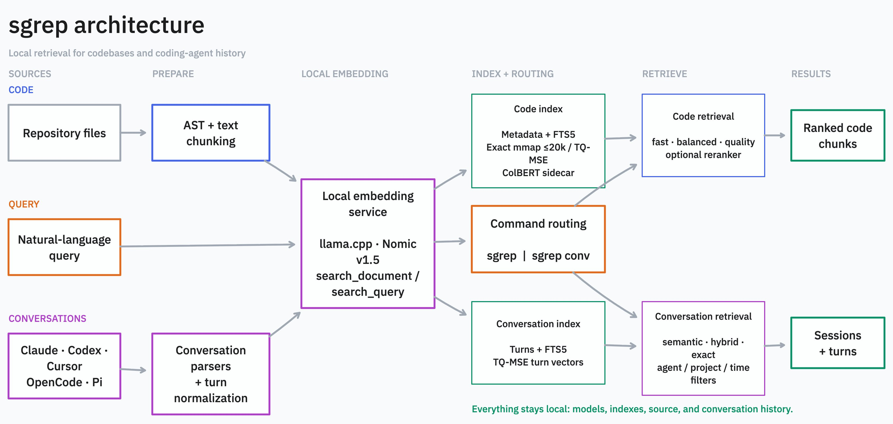

# sgrep

**Local semantic and hybrid search for codebases and coding-agent history.**

Find implementation by intent, then recover the decisions and fixes that led
to it across Claude Code, Codex, Cursor, OpenCode, and Pi sessions.

[Documentation](https://xiaocui.me/sgrep/) ·
[Getting started](https://xiaocui.me/sgrep/guides/getting-started/) ·
[CLI reference](https://xiaocui.me/sgrep/reference/cli/) ·
[Agent skill](SKILL.md)

## Why sgrep?

- Search code by meaning instead of guessing identifiers.
- Search prior agent sessions without reopening transcripts one by one.
- Keep source, conversations, models, and indexes on your machine.
- Give coding agents compact file-and-line results instead of large context dumps.

```bash
sgrep "where do we validate authentication tokens"
sgrep conv "why did we change the authentication cache key"
```

## Install

```bash
brew tap XiaoConstantine/tap
brew install sgrep

# Download the local embedding model and verify llama.cpp.
sgrep setup
```

Prebuilt x86_64 releases include Go 1.27's experimental portable SIMD TQ
rotation kernels; Apple Silicon releases use NEON assembly. No runtime
configuration is needed.

See the [installation guide](https://xiaocui.me/sgrep/guides/getting-started/)
for curl, Go, source builds, and sqlite-vec.

## Search a Codebase

```bash
cd your-repository
sgrep index .

sgrep "database connection error handling"              # balanced, the default
sgrep --profile fast "request routing"                   # lowest latency
sgrep --profile quality "JWT validation middleware"     # optional ColBERT reranking
```

| Profile | Pipeline | Use it for |
|---------|----------|------------|
| `fast` | Semantic | Quick exploration |
| `balanced` | Semantic + BM25 | Recommended everyday profile; default |
| `quality` | Semantic + BM25 + ColBERT | Optional reranking experiments |

[Code-search guide →](https://xiaocui.me/sgrep/guides/code-search/)

## Search Agent Conversations

```bash
sgrep conv index

sgrep conv "embedding server ownership bug"
sgrep conv "session compaction" --agent codex --since 7d
sgrep conv recall -- "what did prior agents decide, implement, and leave unfinished?"
sgrep conv resume <session_id>
```

Conversation search supports Claude Code, Codex CLI, Cursor, OpenCode, and Pi,
with semantic, hybrid, and exact retrieval.

[Conversation-search guide →](https://xiaocui.me/sgrep/guides/conversation-search/)

## Built for Coding Agents

`sgrep` complements structural and exact search:

| Tool | Finds | Example |
|------|-------|---------|
| `sgrep` | Intent | `sgrep "authentication logic"` |
| `ast-grep` | Structure | `sg -p '$fn($args)'` |
| `ripgrep` | Exact text | `rg "JWT_SECRET"` |

Install the shared agent skill:

```bash
npx skills add XiaoConstantine/sgrep --skill sgrep -g
```

Claude Code users can also install automatic project indexing and watch hooks:

```bash
sgrep install-claude-code
```

[Agent-integration guide →](https://xiaocui.me/sgrep/guides/agent-integration/)

## Architecture

[](docs/static/architecture.jpg)

The managed local llama.cpp service is shared, while code and conversation
indexes retain separate retrieval controls. The editable diagram source is at
[docs/static/architecture.tldr](docs/static/architecture.tldr).

[Architecture details →](https://xiaocui.me/sgrep/architecture/)

## Final Pooled Local Benchmark

In the final controlled local-only comparison, `sgrep balanced` is the
strongest overall local quality-latency tradeoff and the strongest normalized
implementation-code retriever by point estimate. It is not universally best,
and the bootstrap confidence intervals overlap competing tools.

| Evaluation track | Point-estimate result |
|------------------|-----------------------|
| Normalized implementation code | `sgrep balanced`: MRR **0.792**, NDCG@10 **0.589**, R@10 **0.413** at **54.4ms** median |
| Normalized all files | `osgrep` wins MRR (**0.867**); `sgrep balanced`/`quality` win NDCG@10 and R@10 (**0.607** / **0.340**) |
| Native product output | `osgrep` wins MRR (**0.858**) and ChunkHound wins R@10 (**0.236**); `sgrep balanced`'s small NDCG@10 lead is pool-sensitive |

The benchmark used 20 queries, model-judged pooled qrels, sgrep source
`19ebec1`, and the pinned `dspy-go` corpus at `87cb50f`. Query-bootstrap 95%
confidence intervals overlap, so these are point-estimate verdicts rather than
significance claims. `balanced` is recommended over `quality`: it was faster
and matched or beat it on the final normalized metrics. Cloud-backed mgrep is
kept in a separate, quota-interrupted exploratory track and is not part of the
local comparison.

See the [benchmark methodology and full tables](https://xiaocui.me/sgrep/benchmarks/).

## Documentation

| Guide | Covers |
|-------|--------|
| [Getting started](https://xiaocui.me/sgrep/guides/getting-started/) | Installation, setup, first searches |
| [Code search](https://xiaocui.me/sgrep/guides/code-search/) | Profiles, output, watch mode, reranking |
| [Conversation search](https://xiaocui.me/sgrep/guides/conversation-search/) | Sources, filters, view, export, resume |
| [CLI reference](https://xiaocui.me/sgrep/reference/cli/) | Commands and flags |
| [Configuration](https://xiaocui.me/sgrep/reference/configuration/) | Environment and server modes |
| [Storage](https://xiaocui.me/sgrep/reference/storage/) | Index files and vector backends |
| [Library API](https://xiaocui.me/sgrep/library/) | Embedding sgrep in Go |

## Development

```bash
go build -o sgrep ./cmd/sgrep
go test ./...
make lint
```

## License

Apache-2.0
